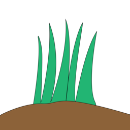

# Elymus: Platform & Stack for true decentralized apps

Elymus is stack for dWeb: Browser, SDK, and bundle of nodes for p2p communication.

It uses Repens protocol for dWeb sites (however you can access usual web2 sites through it, better use normal browser when doing it), developed to provide absolutely decentralized way to host and access frontends.

Repens protocol utilizes [Handshake Protocol](https://handshake.org) as decentralized KV storage and content addressing system, [IPFS](https://ipfs.tech) as p2p caching system (user visits site, and caches its content, while seeding it through p2p network to next visitors, just like torrent but for websites), and [Arweave](https://arweave.org)/[Sia](https://sia.tech)/[Hypercore Protocol](https://hypercore-protocol.org) as content anchoring networks (that will seed frontend when nobody has it in IPFS cache).

You can read how to make your frontend available through Repens protocol here: [HOST-FRONTEND-ON-REPENS.md](./HOST-FRONTEND-ON-REPENS.md)

Elymus is driven by decentralization-first convenience-last ideology. We have already seen many dWeb projects whose only relation to dWeb is that they utilize blockchains in some way. So we are ready to pay with convinience and heavyness for decentralization. We try to utilize lite nodes as much as we can. We try to builtin lite nodes for chains we use in this stack. Where lite nodes are not available, we still use endpoints, but no endpoints are hardcoded, and user can configure every endpoint anytime. We expose these endpoints from user's settings to Repens-based sites and we strongly encourage to use endpoint from user-preferences instead of own hardcoded endpoints.

You can download Elymus on [releases page](https://github.com/angrymouse/elymus/releases/)

TBD:
- Add support for anchoring networks
- Add builtin wallet SDK and builtin lite node for chain with smart contract support that has well support of lite nodes (Considering [Ergo](https://ergoplatform.org/en), but may be other chain)
- Improve UI
- Implement max cached sites in IPFS
- Add builtin SDK for Repens-based sites for gateway-less p2p networking (APIs for swarms, DHTs, etc)
